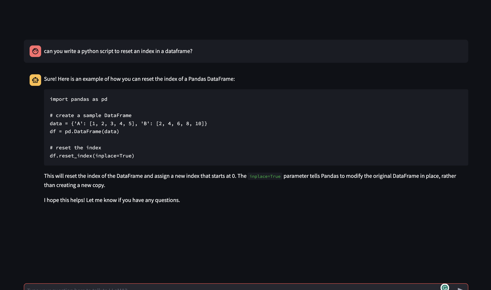

# Alice Chatbot App ⚡

⚡⚡!!!!  I had to halt the project due to the high costs associated with its deployment.  !!!⚡⚡

## 🤔 What is this?

This is an experimental Streamlit chatbot app built for LLaMA2 (or any other LLM). The app includes session chat history and provides an option to select multiple LLaMA2 API endpoints on Replicate.

## Features

- Chat history is maintained for each session (if you refresh, chat history clears)
- Option to select between different LLaMA2 chat API endpoints (7B, 13B or 70B). The default is 70B.
- Configure model hyperparameters from the sidebar (Temperature, Top P, Max Sequence Length).
- Includes "User:" and "Assistant:" prompts for the chat conversation.
- Each model (7B, 13B & 70B) runs on Replicate - (7B and 13B run on one A100 40Gb, and 70B runs on one A100 80Gb).
- Docker image included to deploy this app in Fly.io

## Usage

- Start the chatbot by selecting an API endpoint from the sidebar.
- Configure model hyperparameters from the sidebar.
- Type your question in the input field at the bottom of the app and press enter.

## License

- Web chatbot license (this repo): Apache 2.0
- For the LLaMA models license, please refer to the License Agreement from Meta Platforms, Inc.

## Acknowledgements

- Special thanks to the team at Meta AI, Replicate, a16z-infra and the entire open-source community.

## Disclaimer

This is an experimental version of the app. Use at your own risk. While the app has been tested, the authors hold no liability for any kind of losses arising out of using this application. 

## UI Configuration

The app has been styled and configured for a cleaner look. Main menu and footer visibility have been hidden. Feel free to modify this to your custom application.

## Resources

- [Streamlit Cheat Sheet](https://docs.streamlit.io/library/cheatsheet)
- [GitHub to deploy LLaMA2 on Replicate](https://github.com/a16z-infra/cog-llama-template)
